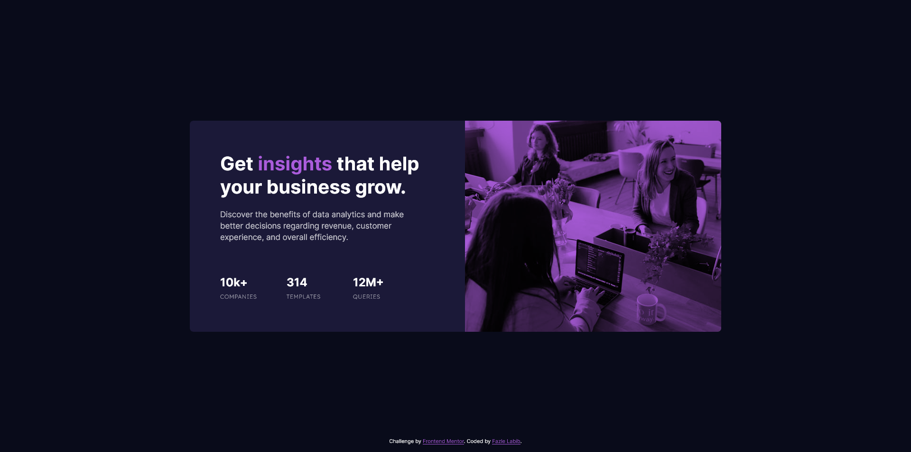
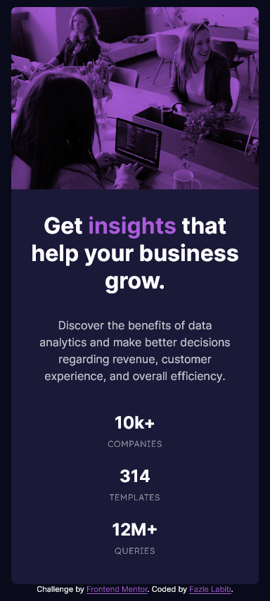

# Frontend Mentor - Stats preview card component solution

This is a solution to the [Stats preview card component challenge on Frontend Mentor](https://www.frontendmentor.io/challenges/stats-preview-card-component-8JqbgoU62). Frontend Mentor challenges help you improve your coding skills by building realistic projects. 

## Table of contents

- [Overview](#overview)
  - [The challenge](#the-challenge)
  - [Screenshot](#screenshot)
  - [Links](#links)
- [My process](#my-process)
  - [Built with](#built-with)
  - [What I learned](#what-i-learned)
  - [Continued development](#continued-development)
  - [Useful resources](#useful-resources)
- [Author](#author)
- [Acknowledgments](#acknowledgments)

<!-- **Note: Delete this note and update the table of contents based on what sections you keep.** -->

## Overview

### The challenge

Users should be able to:

- View the optimal layout depending on their device's screen size

### Screenshot




<!-- Add a screenshot of your solution. The easiest way to do this is to use Firefox to view your project, right-click the page and select "Take a Screenshot". You can choose either a full-height screenshot or a cropped one based on how long the page is. If it's very long, it might be best to crop it.

Alternatively, you can use a tool like [FireShot](https://getfireshot.com/) to take the screenshot. FireShot has a free option, so you don't need to purchase it. 

Then crop/optimize/edit your image however you like, add it to your project, and update the file path in the image above.

**Note: Delete this note and the paragraphs above when you add your screenshot. If you prefer not to add a screenshot, feel free to remove this entire section.** -->

### Links

- Solution URL: [https://github.com/FazleLabib/frontend-mentor-stats-preview-card-component](https://github.com/FazleLabib/frontend-mentor-stats-preview-card-component)
- Live Site URL: [https://fazlelabib.github.io/frontend-mentor-stats-preview-card-component](https://fazlelabib.github.io/frontend-mentor-stats-preview-card-component)

## My process

### Built with

- Semantic HTML5 markup
- CSS custom properties
- Flexbox
- CSS Grid
- Mobile-first workflow

<!-- **Note: These are just examples. Delete this note and replace the list above with your own choices** -->

### What I learned

Learned more about Flexbox and CSS Grid. Learned how to add overlay color over an image and how to use the `mix-blend-mode` attributes.

I tried using ```<picture></picture>``` tags to show images in different screen sizes but I was having a hard time setting the border-radius in correct corners for the mobile screen size. So, used the usual ```</img>``` tag instead with `display` attribute to hide or show the images.

Would appreaciate any feedback and would love to know a more efficient way of handling the images.

<!-- ```html
<h1>Some HTML code I'm proud of</h1>
``` -->
```css
.image {
    position: relative;
}

.image::before {
    content: "";
    position: absolute;
    top: 0;
    left: 0;
    width: 100%;
    height: 100%;
    background-color: var(--soft-violet); 
    mix-blend-mode: multiply;
    pointer-events: none;
    border-radius: 0 var(--border-radius) var(--border-radius) 0;
}
```
<!-- ```js
const proudOfThisFunc = () => {
  console.log('🎉')
}
``` -->

<!-- If you want more help with writing markdown, we'd recommend checking out [The Markdown Guide](https://www.markdownguide.org/) to learn more.

**Note: Delete this note and the content within this section and replace with your own learnings.** -->

### Continued development

Still not comfortable with media queries, so going to continue practicing on more responsive design projects. 

<!-- **Note: Delete this note and the content within this section and replace with your own plans for continued development.** -->

### Useful resources

- [mix-blend-mode](https://developer.mozilla.org/en-US/docs/Web/CSS/mix-blend-mode) - This helped me to easily play with different overlay shades.

<!-- **Note: Delete this note and replace the list above with resources that helped you during the challenge. These could come in handy for anyone viewing your solution or for yourself when you look back on this project in the future.** -->

## Author

<!-- - Website - [Add your name here](https://www.your-site.com) -->
- Frontend Mentor - [@FazleLabib](https://www.frontendmentor.io/profile/FazleLabib)
<!-- - Twitter - [@yourusername](https://www.twitter.com/yourusername) -->

<!-- **Note: Delete this note and add/remove/edit lines above based on what links you'd like to share.** -->

## Acknowledgments

I would like to thank [Rebecca Padgett](https://www.frontendmentor.io/profile/bccpadge) for her feedback on my "Product preview card component" solution. That helped me write better and more accessible code for this project.

<!-- **Note: Delete this note and edit this section's content as necessary. If you completed this challenge by yourself, feel free to delete this section entirely.** -->
